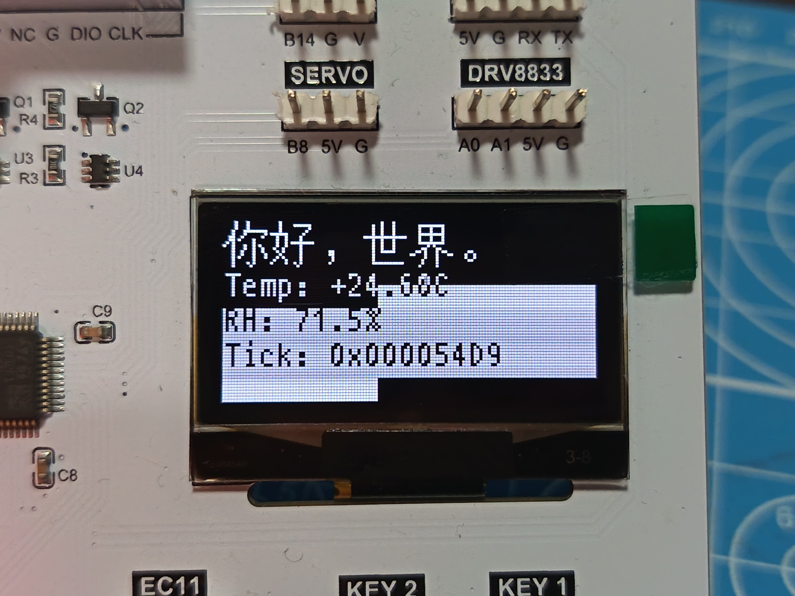
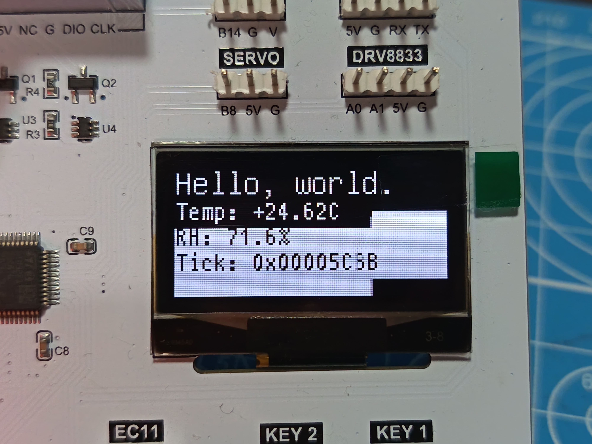
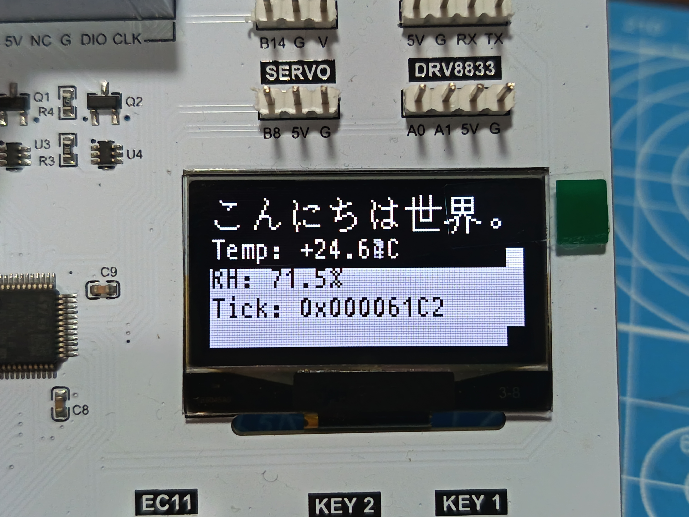
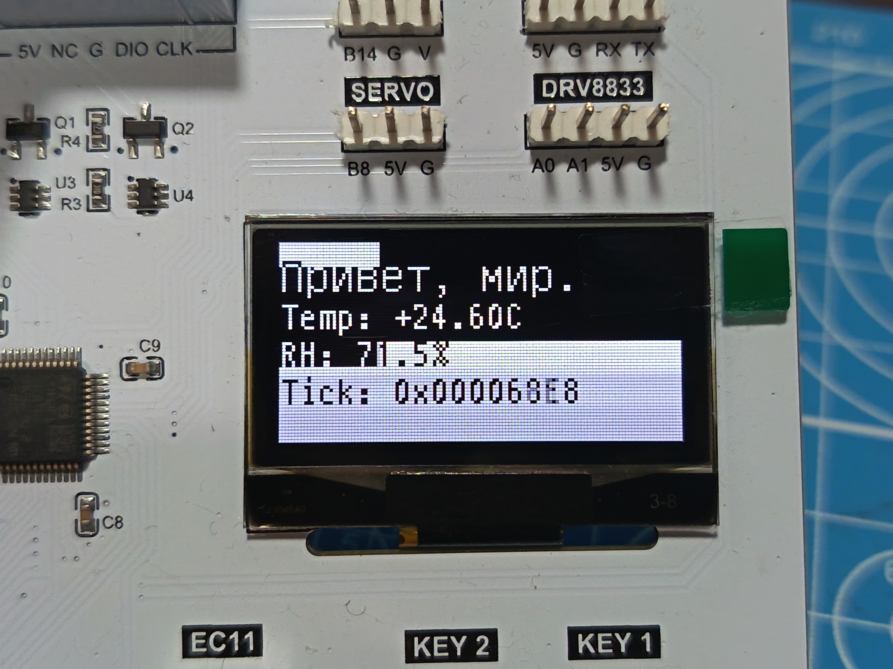

# stm32-learning-05-oled

STM32 Practice Code #05: Operating an OLED screen.

[English](./README.md) | [中文](./README.zh-cn.md)

Learn how to use the OLED screen on the development board.

## Overview

This project uses the u8g2 library to control an OLED screen driven by a CH1116 chip, and displays temperature and humidity information on it.

<div>
  <table width="100%" cellspacing="2" cellpadding="0" border="0" cellpadding="0" frame="void">
    <tr>
      <td width="50%"></td>
      <td width="50%"></td>
    </tr>
  </table>
  <table width="100%" cellspacing="2" cellpadding="0" border="0" cellpadding="0" frame="void">
    <tr>
      <td width="25%"></td>
      <td width="25%"></td>
      <td width="25%"></td>
      <td width="25%"></td>
    </tr>
  </table>
</div>

The first line of the screen displays **sample text**; press `Key2` to switch languages. The second line displays the ambient **temperature**; press `Key1` to switch temperature scales. The third line displays the ambient **relative humidity**, and the fourth line displays the current **tick count** in hexadecimal. The red status light flashes for 2 seconds to indicate that the program is running in a non-blocking state.

This project is a practice exercise for [Keysking's STM32 Tutorial](https://www.bilibili.com/video/BV19u4y197df), runs on [his development board](https://docs.keysking.com/docs/stm32/resourcePack/). (In fact, the code implementation has little to do with what he said.)

## Features

- Bare-metal STM32 HAL program written in C++17.
- Fully non-blocking: DMA-based asynchronous I2C; every module is a tick-driven state machine.
- Object-oriented with generic building blocks (state machine, RAII IRQ guard, instance registry), easy to port and extend.

## Implementation Details

### Chip Configuration

- **Clock**
  - **RCC > HSE**: Crystal/Ceramic Resonator
  - **HCLK**: 72 MHz
- **I2C1** (CH1116 OLED, AHT20)
  - **Speed Mode**: Fast Mode (400 kHz)
  - **DMA**: TX on DMA1_CH6, RX on DMA1_CH7
- **GPIO**
  - **PA6/PA7/PB0**: RGB LED
  - **PB12/PB13**: Key1 / Key2

### Programming

Each module is a class whose `loop()` is a non-blocking state machine driven by `HAL_GetTick()`, all called from `cpp_loop()`:

- `utils` — generic building blocks: `State<E>` (tick-based state machine node), `IrqGuard` (RAII interrupt masking), `InstanceRegistry<T>` (CRTP linked-list registry, so `loop()` can fan out to every instance).
- `i2c::Bus` — asynchronous I2C with a task queue (`write` / `read` / `memWrite` / `memRead`) on top of HAL DMA transfers; the HAL IRQ callbacks dispatch completion back to the task hooks.
- `aht20` — non-blocking AHT20 driver: state machine (init → trigger → wait → read) with CRC8 validation; results in `tp` / `rh`. The code is largely reused from [stm32-learning-04-i2c](https://github.com/limpidautumn/stm32-learning-04-i2c).
- `key::Key` — button driver with edge detection and 10 ms debounce; falling/rising edge hooks.
- `oled` — u8g2 wired to the async I2C bus through a custom byte callback (`U8X8_WITH_USER_PTR`); 128×64 framebuffer refreshed every 40 ms; multilingual text rendered from the embedded `u8g2_font_unifont_hello` subset font; `drawRev()` animates a scrolling reverse-video band to prevent screen burn-in.
- `led::StatusLed` — blinks the red LED at a 2s interval.
- `app_main` — `cpp_setup()` / `cpp_loop()`, the entry points called from the CubeMX-generated `main.c`.

The panel (CH1116) is initialized through u8g2's SSD1309-compatible sequence (`u8x8_d_ssd1309_128x64_noname2`).

## Structure

```
stm32-learning-05-oled
├───CMakeLists.txt
├───README.md
├───stm32-learning-05-oled.ioc
├───Core
│   ├───Inc
│   │   ├───aht20.hpp
│   │   ├───app_main.hpp
│   │   ├───i2c.hpp
│   │   ├───key.hpp
│   │   ├───led.hpp
│   │   ├───main.h
│   │   ├───oled.hpp
│   │   ├───u8g2_font_unifont_hello.h
│   │   └───utils.hpp
│   └───Src
│       ├───aht20.cpp
│       ├───app_main.cpp
│       ├───i2c.cpp
│       ├───key.cpp
│       ├───led.cpp
│       ├───main.c
│       ├───oled.cpp
│       └───u8g2_font_unifont_hello.c
└───Drivers
```

User-written files only; the HAL/CMSIS library and CubeMX-generated sources (`dma.c`, `gpio.c`, `i2c.c`, `usart.c`, etc.) are omitted.

## What I Learned

- Using the u8g2 library to drive an OLED screen and connect it to a custom asynchronous I2C transport layer.
- Non-blocking design: DMA I2C + state machines instead of blocking IRQ waits.
- C++ on bare metal: CRTP instance registry, RAII guards, generic state machine.
- AHT20 temperature/humidity sensor: measurement protocol and CRC8 checksum.
- Button debouncing and edge detection.
- Unicode subset fonts for multilingual text.
